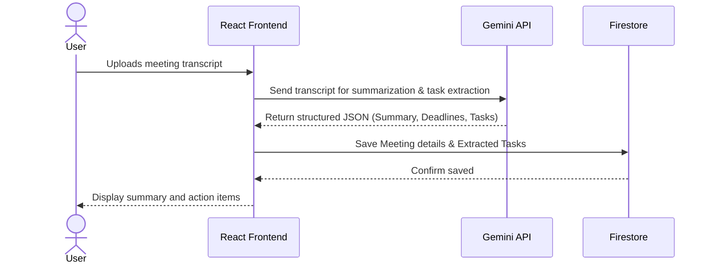
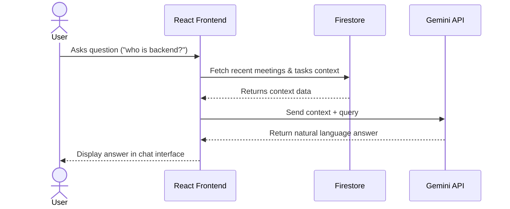

# FlowPilot AI

## Project Description
FlowPilot AI is a team productivity operating system that transforms chaotic meetings into structured tasks automatically. It serves as an intelligent knowledge base that remembers past meetings, extracts action items, prioritizes tasks, and generates daily standup updates. By leveraging Gemini AI and Firebase, FlowPilot AI streamlines project management and keeps your team aligned without the manual overhead.

## Architecture Overview
FlowPilot AI is designed with a modern React frontend and a flexible API architecture that can run either on a dedicated backend server or as a fully client-side application (useful for static hosting platforms like Netlify).

- **Frontend**: Built with React, Vite, and Tailwind CSS. It uses React Router for navigation and Framer Motion for smooth animations.
- **Backend / AI Integration**: Uses an Express.js backend (when self-hosted) to securely communicate with the Gemini API to extract tasks, summarize meetings, and answer queries. For static deployments (e.g., Netlify), it automatically falls back to client-side API requests.
- **Authentication & Database**: Powered by Firebase. Uses Google Sign-in to authenticate users and Firebase Firestore rules to securely store and retrieve user data, meeting transcripts, and action items.

### High-Level Design (System Architecture)
```mermaid
graph TD
    User([User]) -->|Interacts with| UI[React Frontend (Vite + Tailwind)]
    
    subgraph Frontend Layer
        UI
    end
    
    subgraph Authentication & Data Layer
        UI -->|Google Sign-In| FirebaseAuth[Firebase Authentication]
        UI -->|CRUD Operations| Firestore[(Firebase Firestore)]
    end
    
    subgraph AI Processing Layer
        UI -->|API Requests| API{AI API Routing}
        API -->|Node.js Env| Express[Express.js Backend /api/*]
        API -->|Static Env (Netlify)| Fallback[Client-Side Fallback]
        Express -->|Prompt| Gemini[Google Gemini API]
        Fallback -->|Prompt| Gemini
    end
```

### Low-Level Design (Working Workflows)

**1. Meeting Analysis & Task Extraction Workflow**


**2. Knowledge Base (Chat) Workflow**


## Setup Instructions

### 1. Prerequisites
- Node.js (v18+)
- A Firebase project with Google Authentication and Firestore enabled
- A Gemini API Key from Google AI Studio

### 2. Environment Variables
Create a `.env` file in the root of the project with the following configuration. Reference the `.env.example` file if needed.
```env
# Gemini API Setup (Choose ONE depending on your deployment)
GEMINI_API_KEY="YOUR_GEMINI_API_KEY_HERE" # Use for local dev / typical backend deployments
VITE_GEMINI_API_KEY="YOUR_GEMINI_API_KEY_HERE" # Use for Netlify / Static hosting fallback

# Firebase Setup
VITE_FIREBASE_API_KEY="your-api-key"
VITE_FIREBASE_AUTH_DOMAIN="your-auth-domain"
VITE_FIREBASE_PROJECT_ID="your-project-id"
VITE_FIREBASE_STORAGE_BUCKET="your-storage-bucket"
VITE_FIREBASE_MESSAGING_SENDER_ID="your-sender-id"
VITE_FIREBASE_APP_ID="your-app-id"
```
*(Also update `firebase-applet-config.json` with your project configuration to ensure Firebase connects properly).*

### 3. Installation
Install the project dependencies:
```bash
npm install
```

### 4. Running the App Locally
Start the development server:
```bash
npm run dev
```

### 5. Building for Production
To build the application for deployment:
```bash
npm run build
```
This will compile your Vite project into static files located in the `dist/` directory.

## Dependencies
- **Core**: React 19, React Router v7, Vite
- **Styling UI**: Tailwind CSS v4, Lucide React, Framer Motion, shadcn components
- **Database Auth**: Firebase (v12.13.0)
- **AI Core**: `@google/genai` (Gemini SDK)
- **Utilities**: Date-fns, Zod, UUID, Mammoth (for text/document parsing)
- **Backend Server**: Express, dotenv, tsx

## AI Tools Used
- **Gemini 2.5 Flash**: Used as the core intelligence engine to:
  - Extract structured Tasks from meeting transcripts.
  - Summarize raw meeting transcripts into key discussion points, decisions, blockers, and deadlines.
  - Generate personalized daily standup summaries.
  - Prioritize tasks sequentially.
  - Provide a conversational Chat Interface ("Knowledge Base") that retrieves context about past meetings and discussions.
- **Google AI Studio**: Used to prompt, iterate, and orchestrate the model instructions and generate the production application workspace.

## Team Member Details
- **Meghraj Dewangan**
  - **Role**: Full Stack Developer / AI Engineer
  - **Responsibilities**: Implemented the primary architecture, integrated Firebase Authentication Firestore, built the fallback logic for static hosting on Netlify, integrated the Gemini AI models for task extraction and conversational query answering, and designed the React-based user interface using Tailwind CSS and Framer Motion.
